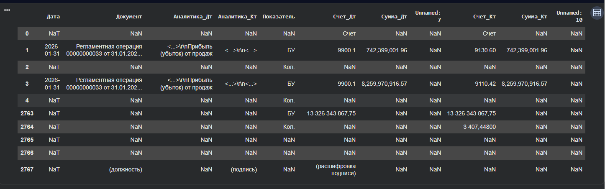
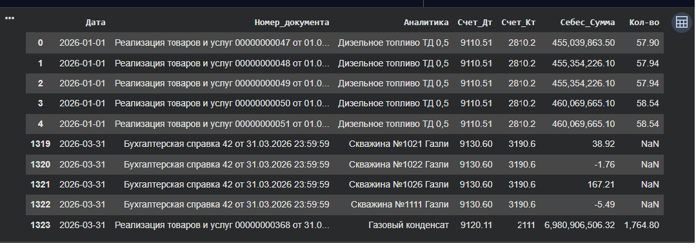
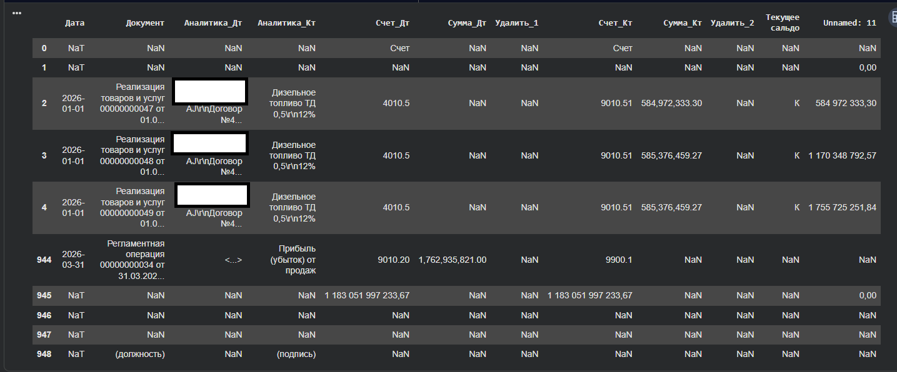
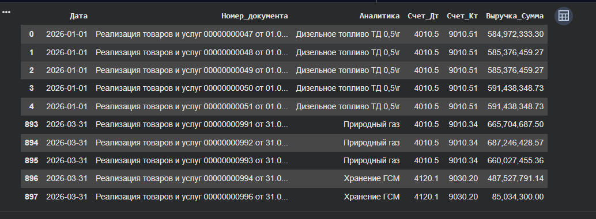
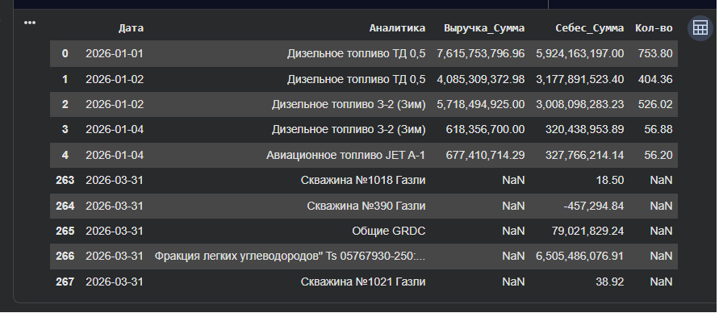

# Revenue & Cost of Sales ETL

Python and DuckDB SQL project demonstrating the automation of financial data processing and ETL workflows for **Revenue** and **Cost of Sales** reporting.

The project implements an end-to-end **ETL pipeline** for loading, cleansing, transforming and consolidating accounting data exported from **1C**, resulting in the generation of a unified analytical dataset for financial reporting and further use in Excel and BI systems.

> **Note:** All source data, entity names and file paths have been anonymized for public release.

---

## Technology Stack

**Python • Pandas • NumPy • DuckDB SQL • ETL • Financial Data Analysis • Excel**

---

## Jupyter Notebook
A direct link to the complete Jupyter Notebook containing the full ETL workflow, data transformation logic, and SQL processing steps:

📓 [Open Jupyter Notebook](./Revenue_Cost_of_Sales_ETL_Eng.ipynb)

---

## Workflow

### 1. Source Cost of Sales Data

### 2. Cost of Sales Data Cleansing and Transformation

### 3. Source Revenue Data

### 4. Revenue Data Cleansing and Transformation

### 5. Final Analytical Dataset

---

## Skills Demonstrated

- Python (Pandas, NumPy)
- DuckDB SQL
- ETL Pipeline Development
- Financial Data Processing
- Accounting Data Transformation
- Data Cleansing and Consolidation
- Financial Reporting Automation
- Analytical Dataset Preparation
- Excel and BI Data Integration

---

*This repository is intended solely to demonstrate practical skills in financial data processing, ETL development, and reporting automation. All business-sensitive information has been anonymized.*
